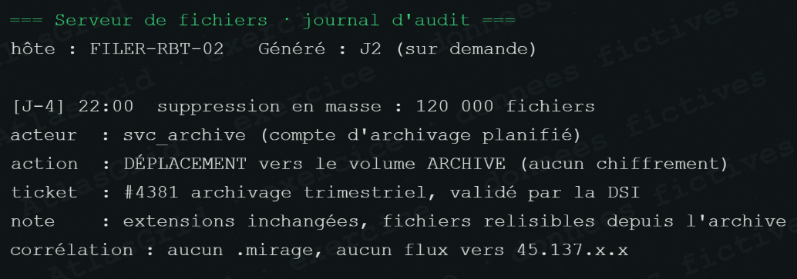

# Bruit A-27 — Archivage trimestriel autorisé

## Signal enregistré

Un volume important de fichiers est déplacé ou archivé, comportement qui peut ressembler à une manipulation massive de données pendant une attaque.

## Contexte et raison du classement

L'activité correspond à l'archivage trimestriel prévu par le ticket **#4381**. Les fichiers restent lisibles, aucune extension `.mirage` ni opération de chiffrement n'est constatée, et le traitement n'est pas corrélé aux hôtes ou à la séquence MIRAGE.

## Réponse courte au jury

> « Le volume seul n'est pas une preuve de ransomware. Le ticket, le calendrier, la lisibilité des fichiers et l'absence de corrélation confirment un archivage autorisé. »

## Suite et conformité

Conserver le ticket, les journaux de tâches et un échantillon de contrôle attestant que les fichiers sont lisibles. Référence : [REFERENCES_TRIAGE_ET_CONFORMITE.md](REFERENCES_TRIAGE_ET_CONFORMITE.md).
