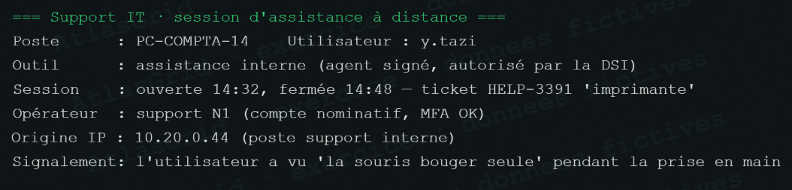

# Bruit A-41 — Assistance à distance autorisée

## Signal enregistré

Une prise en main à distance est observée. Ce comportement ressemble à une connexion d'administration et doit être comparé à la piste VPN anormale avant toute conclusion.

## Contexte et raison du classement

L'intervention est rattachée au ticket **HELP-3391**, l'opérateur est identifié et le MFA est valide. Le périmètre de l'assistance est autorisé et aucune action ne correspond à l'exécution MIRAGE, au sabotage des sauvegardes ou à l'exfiltration.

## Réponse courte au jury

> « Nous avons distingué une session d'assistance traçable d'un accès anormal : ticket, identité et MFA valident cette intervention. Elle ne partage aucun indicateur avec la chaîne MIRAGE. »

## Suite et conformité

Archiver le ticket, l'identité de l'opérateur, le journal MFA et la plage de session ; garder les accès à distance sous revue périodique. Référence : [REFERENCES_TRIAGE_ET_CONFORMITE.md](REFERENCES_TRIAGE_ET_CONFORMITE.md).
