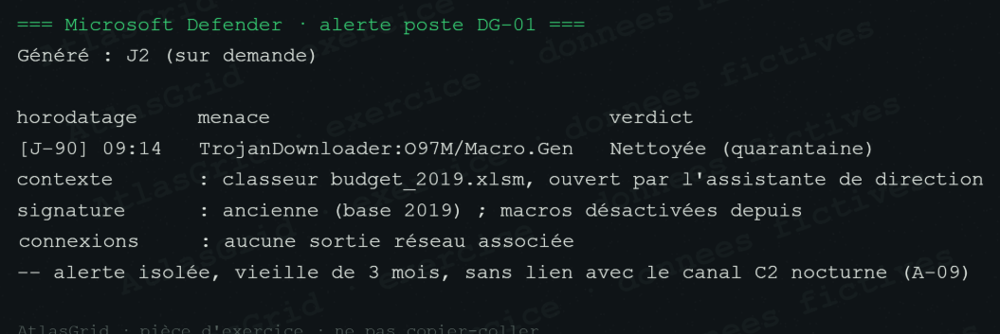

# Bruit A-31 — Alerte macro historique sur DG-01

L'alerte concerne un classeur de 2019, traité par quarantaine à J-90. Les macros étaient déjà désactivées et aucune sortie réseau associée n'est observée.

**Verdict : Bruit, confiance sûre.** L'alerte est ancienne, nettoyée et sans lien avec le canal C2 nocturne de MIRAGE.
