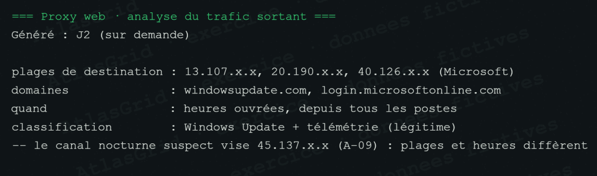

# Bruit A-29 — Trafic sortant Microsoft légitime

Les destinations Microsoft et les domaines `windowsupdate.com` et `login.microsoftonline.com` sont sollicités pendant les heures ouvrées, depuis l'ensemble des postes. L'activité correspond à Windows Update et à la télémétrie attendue.

**Verdict : Bruit, confiance sûre.** Ce trafic diffère du canal nocturne suspect vers `45.137.x.x` par ses destinations, ses horaires et son périmètre.
