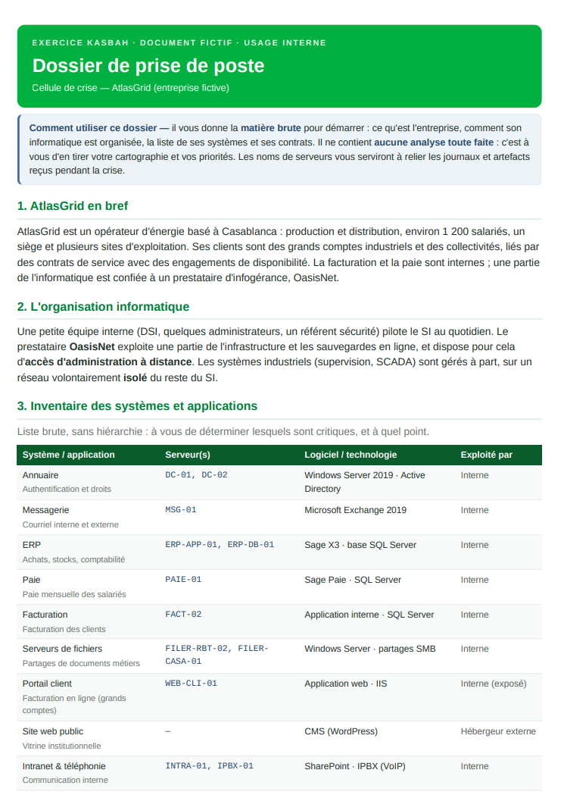
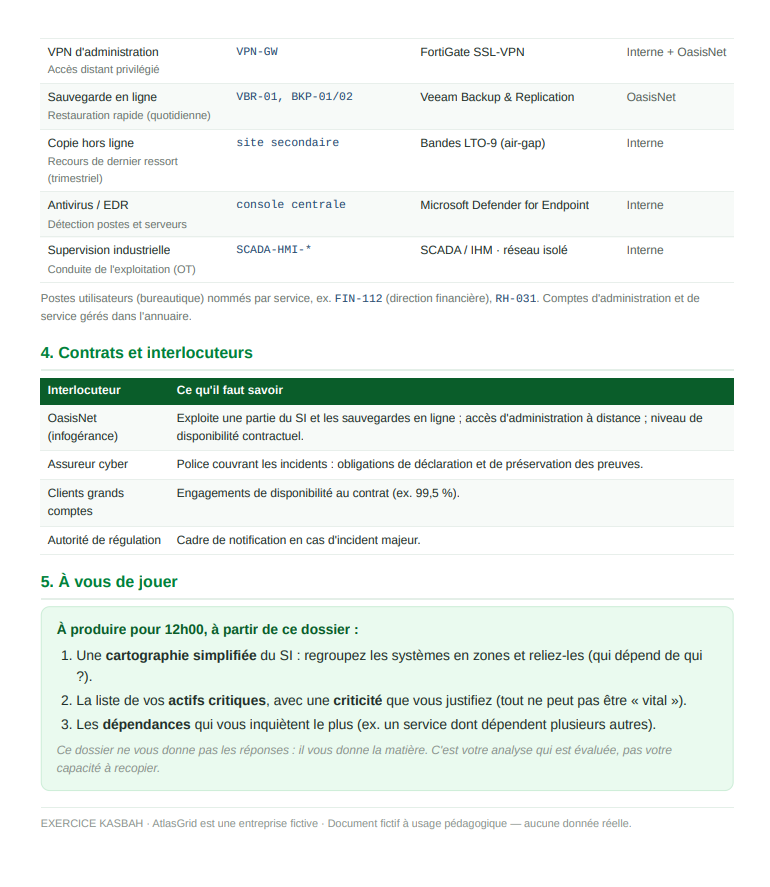
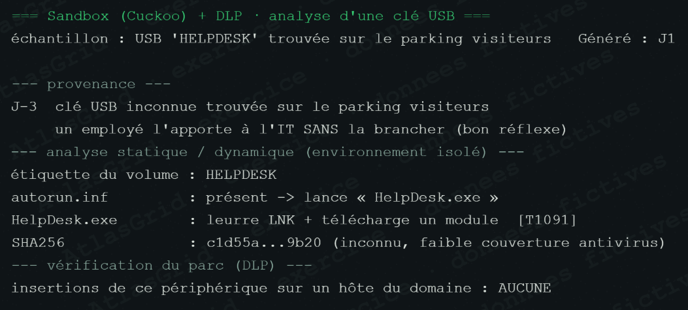
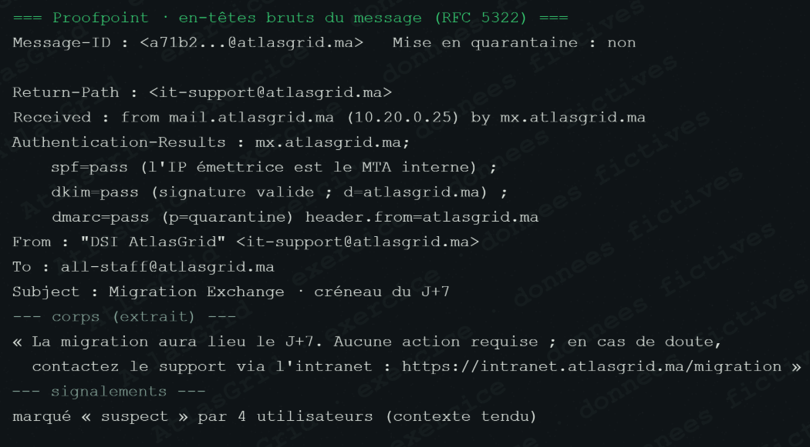
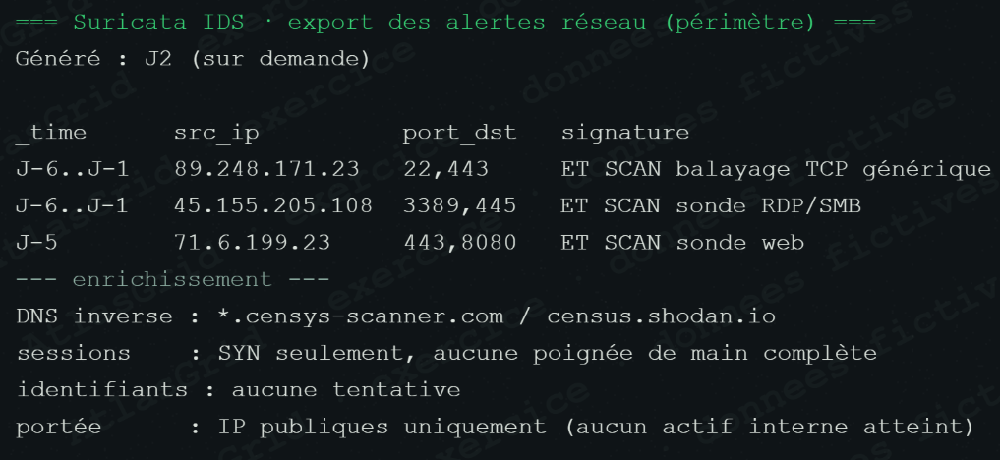
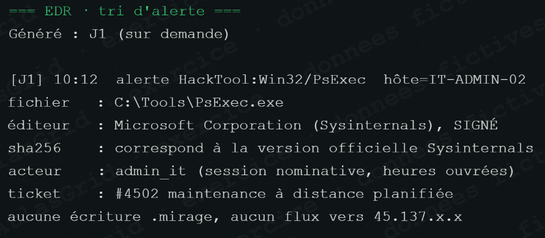
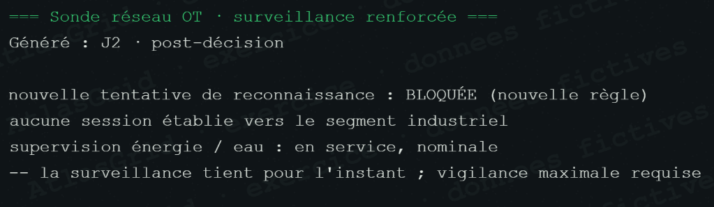
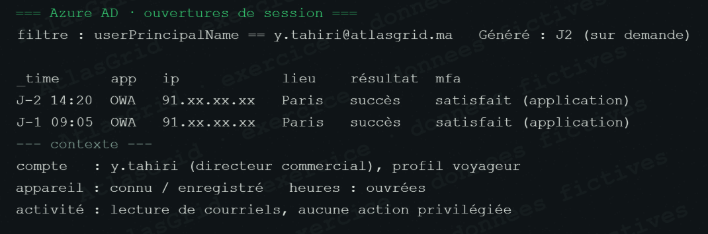
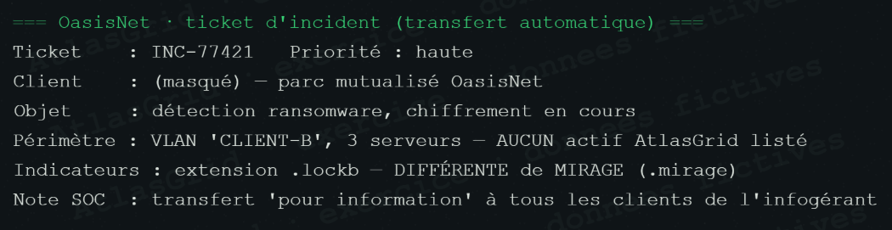
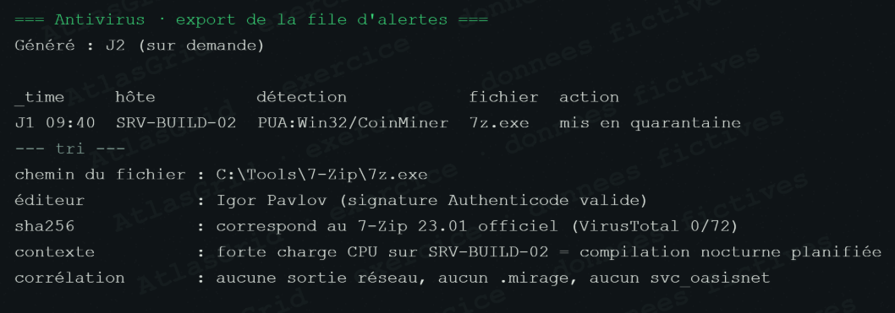

# Galerie chronologique des captures — AtlasGrid / MIRAGE

Cette galerie accompagne la [fiche de chronologie complète](FICHE_CHRONOLOGIE_COMPLETE.md). Les visuels sont affichés dans l'ordre du déroulé de l'exercice ; ils restent stockés dans leurs dossiers d'origine, sans duplication inutile.

## 0. Briefing et périmètre initial

### Dossier de prise de poste — organisation et inventaire initial

### Dossier de prise de poste — contrats, sauvegardes et attendus

## 1. Acte I — signaux faibles et premières qualifications

### 01 — A-11 : hameçonnage `atlasgrid-it.info` — Preuve

Le message est techniquement un phishing ; son lien causal avec MIRAGE reste à établir.

### 02 — A-01 : détection MIRAGE sur FIN-112 — Preuve

L'EDR établit la compromission de FIN-112 et l'écriture massive de fichiers.

### 03 — A-19 : clé USB du parking — Fausse piste

Support suspect analysé en sandbox, mais jamais connecté à AtlasGrid.

### 04 — A-02 : sessions VPN `svc_oasisnet` — Preuve

Accès nocturnes sans MFA et hors profil normal du prestataire.

### 05 — A-20 : courriel de migration vérifié — Fausse piste

Ce message ressemble au leurre, mais ses contrôles d'authentification et son lien intranet sont valides.

### 06 — A-14 : badge du datacenter — Fausse piste

La badgeuse est en maintenance et aucune corrélation technique indépendante n'existe.

### 07 — A-17 : copie USB de paie — Fausse piste

Copie de 44 Mo autorisée par ticket, sans sortie réseau et sans lien avec l'exfiltration.

### 08 — A-05 : sauvegardes sabotées — Preuve

La rétention est modifiée avant l'attaque et les dépôts deviennent ensuite indisponibles.

### Décision — Isoler FIN-112 sans l'éteindre

Le confinement coupe la propagation tout en préservant mémoire, processus et connexions utiles à l'enquête.

## 2. Acte II — ransomware, propagation et reconstitution technique

### 09 — A-09 : règle pare-feu et canal de commande — Preuve

La règle `OUT-TEMP-443` ouvre un flux non journalisé, ensuite utilisé à intervalles réguliers par FIN-112.

### 10 — A-04 : métadonnées NTFS de la note MIRAGE — Preuve

Les dates contradictoires imposent de retenir la chronologie corroborée par les autres sources.

### 11 — A-13 : inventaire de l'impact — Preuve

23 serveurs sur 40 sont chiffrés ; l'inventaire pilote le confinement et la reprise.

### 12 — A-10 : corrélation SIEM — Preuve

Les événements Windows recoupent le VPN, les privilèges, l'exécution du binaire et l'effacement des traces.

### 13 — A-03 : transferts proxy de 117,8 Go — Preuve

Le proxy mesure les flux nocturnes vers une même destination externe ; le contenu exact reste à qualifier.

### 14 — A-12 : chronologie EDR de FIN-112 — Preuve

Les trois minutes d'attaque reconstituent la séquence : exécution, désactivation, lecture, C2, chiffrement et sabotage.

### Décision — Isoler les segments critiques

Les flux et partages non indispensables sont coupés tout en préservant les activités indispensables.

### Décision — Communication interne mesurée

La cellule répond à la rumeur, sans dévoiler de détails sensibles ni promettre l'absence d'impact.

## 3. Diversions, incidents parallèles et triage

### 15 — A-16 : pic de trafic lié à la presse — Fausse piste

Le trafic provient de visiteurs humains après un article ; le cache tient et aucun DDoS n'est établi.

### 16 — A-23 : fraude au président — Preuve, mais incident distinct

La demande de 480 000 MAD est bloquée. Elle est confirmée, sans être artificiellement reliée à MIRAGE.

### 17 — A-15 : jeton d'ex-salarié — Fausse piste

Le jeton résiduel est un défaut de gestion d'accès à corriger, mais aucune activité MIRAGE ne lui est associée.

### 18 — A-21 : scans Internet génériques — Bruit

Les SYN Censys/Shodan ne touchent pas d'actif interne et ne constituent pas une intrusion AtlasGrid.

### 19 — A-25 : PsExec de maintenance — Bruit

Outil signé, utilisé dans le cadre du ticket #4502 ; aucune corrélation avec MIRAGE.

### 20 — A-27 : archivage trimestriel — Bruit

Opération autorisée par le ticket #4381 : les fichiers restent lisibles et ne sont pas chiffrés.

### 21 — Décision OT : surveillance renforcée

Une reconnaissance est détectée sans session compromise. L'OT, déjà isolé, est maintenu avec des critères de coupure explicites.

### 22 — A-26 : connexion Paris — Bruit

Appareil connu, activité de messagerie normale et contexte de déplacement : aucune corrélation MIRAGE.

### 23 — A-40 : ticket OasisNet d'un autre client — Bruit

Le ticket mentionne `.lockb`, mais ne concerne aucun actif AtlasGrid ni les indicateurs MIRAGE.

### 24 — A-24 : salarié en litige — Fausse piste

Les journaux VPN, AD et badge ainsi que l'arrêt de travail écartent la personne de la fenêtre d'attaque.

### 25 — A-18 : extrait initial de la revendication DarkAtlas

La première capture est conservée comme élément de veille ; elle exigeait une comparaison avec les preuves internes.

### 26 — A-18 : revendication DarkAtlas invalidée — Fausse piste

Les données sont publiques et les indicateurs (extension, chronologie, canal) ne correspondent pas à MIRAGE.

### 27 — A-41 : assistance distante — Bruit

Session autorisée, opérateur identifié, ticket HELP-3391 et MFA valide.

### 28 — A-22 : faux positif cryptominer — Bruit

L'alerte vise 7-Zip signé pendant une compilation nocturne ; ni minage ni lien MIRAGE ne sont établis.

## 4. Pression externe, obligations et exposition

### Décision — Déclarer l'assureur immédiatement

La déclaration respecte le délai de 48 heures propre au scénario et préserve l'accès aux experts et à la couverture.

### Décision — Répondre à Maghreb Éco

AtlasGrid fournit une version factuelle, sans reprendre la revendication des attaquants comme un fait.

### Décision — Répondre factuellement à Chérifienne des Mines

Le client reçoit les mesures prises et un engagement de mise à jour, sans attestation non prouvée sur son exposition.

### Décision — Notifier l'Autorité de manière transparente

La notification comporte les faits connus, les inconnues et un calendrier de compléments dans le délai de l'exercice.

### 29 — A-07 : publication SIROCCO — Preuve d'exposition

L'échantillon de données clients et contractuelles est réel. Les 300 Go annoncés demeurent une revendication qui n'est pas confirmée par les journaux internes.

## Vérification de lecture

- Les événements datés techniquement doivent être cités à partir de la [chronologie technique](FICHE_CHRONOLOGIE_COMPLETE.md#1-chronologie-technique-reconstituée).
- Les deux copies archivistiques A-20 et A-13 ont été retirées ; la capture DarkAtlas initiale est conservée avec son analyse d'invalidation, car elles documentent deux moments distincts.
- La galerie montre des événements de l'exercice, pas une attribution nominative de l'attaque. Toute prise de parole doit respecter les qualifications retenues : preuve, fausse piste, bruit ou décision.
