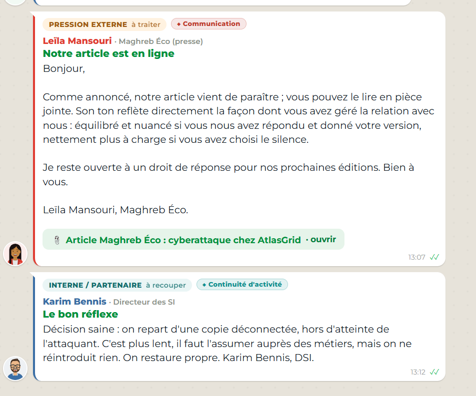

# Décision 06 — Répondre à la presse avec une version vérifiée

## Décision retenue

Répondre au journaliste avant son échéance avec une déclaration courte et cohérente : AtlasGrid traite un incident, a activé ses mesures de réponse, collabore avec les parties compétentes et communiquera les informations confirmées au moment approprié.

## Faits établis au moment du choix

- Un média demande une réponse dans un délai court ; l'absence de réponse laisse le récit public reposer uniquement sur des sources externes.
- Les preuves **A-01**, **A-03**, **A-12** et **A-13** confirment un incident cyber significatif.
- La preuve **A-07** rend compte d'une revendication et d'échantillons publiés ; elle ne confirme pas automatiquement le volume revendiqué ni l'ensemble des personnes concernées.

## Pourquoi ce choix est défendable

Répondre ne signifie pas tout révéler. Une version factuelle, validée par la cellule, évite le déni, réduit le risque de contradiction ultérieure et démontre que l'entreprise pilote la situation. Elle protège aussi les personnes concernées en excluant les détails techniques, les données personnelles, les éléments d'enquête et les volumes non vérifiés.

Le silence aurait été interprété librement par des tiers ; un démenti absolu aurait été contredit par les preuves ; une communication exhaustive aurait compromis l'enquête et la confidentialité.

## Réponse courte au jury

> « Nous ne laissons pas une revendication d'attaquant devenir la version officielle. Nous répondons vite, avec des faits vérifiés, sans spéculer ni exposer les personnes ou l'enquête. »

## Résultat observé

Le retour de Maghreb Éco indique que l'article publié est resté équilibré et nuancé parce qu'AtlasGrid a répondu. Cela confirme que la communication factuelle a limité le risque d'un récit exclusivement fondé sur la revendication de l'attaquant.

## Cadre de conformité et suites

- Le NIST CSF 2.0 prévoit une communication coordonnée avec les parties prenantes pendant l'incident.
- La loi n° 09-08 impose une attention particulière à toute divulgation qui pourrait exposer des données à caractère personnel ; le message public doit donc être validé avant diffusion.
- Préparer trois versions alignées : réponse presse, questions-réponses et communiqué de mise à jour ; documenter les validations et corriger publiquement toute information devenue inexacte. Référence commune : [REFERENCES_NORMES_ET_CADRE.md](REFERENCES_NORMES_ET_CADRE.md).
