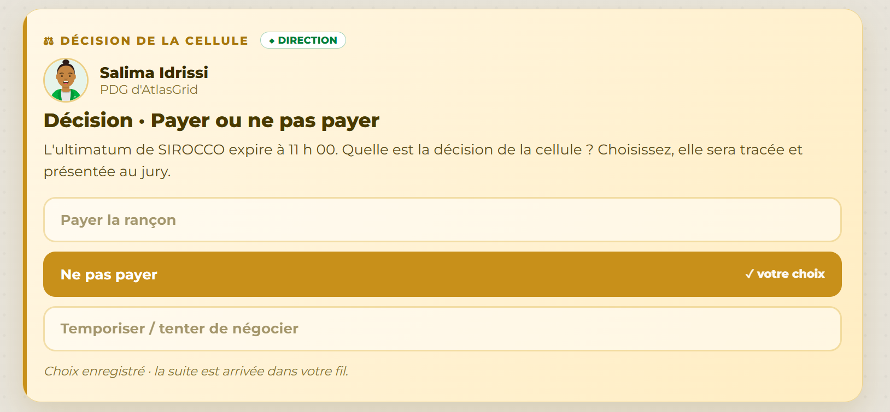

# Décision 09 — Ne pas payer la rançon

## Décision retenue

La Direction refuse de payer la rançon et engage une reprise depuis une source indépendante de l'attaquant.

## Fondement factuel

- A-06 identifie une copie LTO-9 hors ligne à Settat.
- A-30 montre que les points en ligne récents sont suspect ou infecté.
- Aucun élément ne garantit un déchiffrement, l'effacement des données exfiltrées ni le respect de l'attaquant après paiement.

## Alternatives écartées

Payer pourrait accélérer l'espoir d'une reprise, mais sans garantie technique ni opérationnelle. Restaurer vite en ligne réintroduirait un risque avéré de MIRAGE. L'air-gap est plus lent, mais indépendant et contrôlable.

## Justification devant le jury

La décision privilégie l'intégrité de la reprise, la préservation des preuves et l'absence de financement de l'extorsion. Elle reste cohérente avec le NIST CSF 2.0 et SP 800-61 Rev. 3 : restaurer dans un environnement assaini, avec une traçabilité complète. Le cadre commun de conformité est disponible dans [REFERENCES_NORMES_ET_CADRE.md](REFERENCES_NORMES_ET_CADRE.md).
