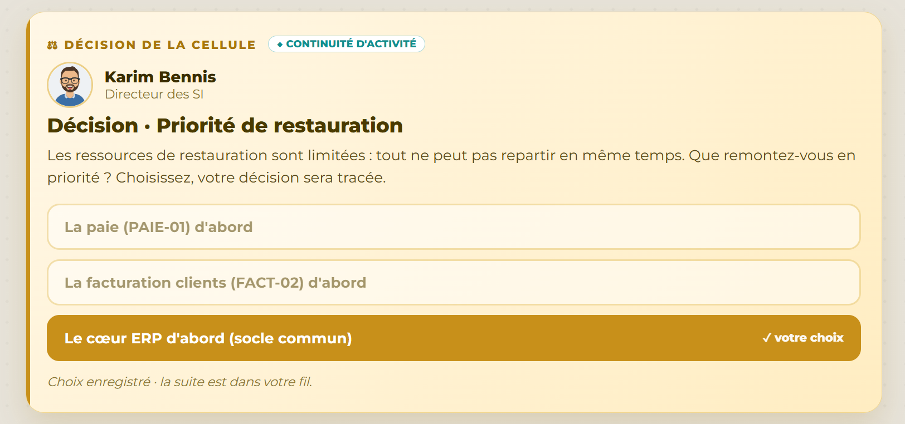

# Décision 10 — Restaurer le cœur ERP en priorité

## Décision retenue

Restaurer d'abord la base et l'applicatif ERP. La paie et la facturation sont reconnectées après ce socle commun.

## Pourquoi ce choix

La séquence de reprise montre que PAIE-01 et FACT-02 dépendent de l'ERP. Réparer ces services isolément donnerait un résultat visible plus vite, mais incomplet et fragile. Restaurer le socle d'abord rétablit plusieurs services de manière cohérente.

## Alternatives écartées

La paie ou la facturation en premier peut répondre à une urgence métier immédiate, mais ne traite pas leurs dépendances. L'ERP demande un chantier initial plus long, puis permet une reprise en chaîne et contrôlée.

## Défense devant le jury

La continuité privilégie les dépendances critiques et l'intégrité des données plutôt qu'un redémarrage partiel. Cette logique est conforme à l'approche de reprise progressive du NIST CSF 2.0 et aux objectifs de disponibilité du cadre de référence mentionné dans [REFERENCES_NORMES_ET_CADRE.md](REFERENCES_NORMES_ET_CADRE.md).
