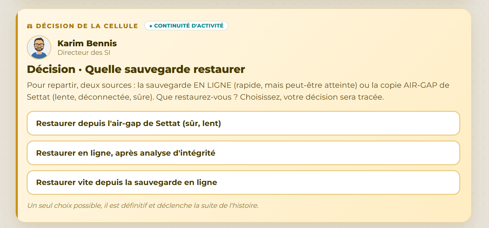

# Décision 11 — Restaurer depuis l'air-gap de Settat

## Décision retenue

Utiliser la copie LTO-9 air-gap de Settat pour la reconstruction, malgré son ancienneté et le délai de restauration.

## Fondement factuel

La copie est physiquement isolée, hors réseau et non concernée par les indicateurs de MIRAGE (A-06, A-30). Les points en ligne les plus récents sont en revanche suspect ou infecté.

## Alternatives écartées

Une restauration en ligne, même après analyse, dépend d'une infrastructure déjà visée par le sabotage et comporte un risque de réinfection. Une restauration rapide sacrifierait la fiabilité de l'environnement de reprise.

## Plan suivi

Acheminement des bandes à J+0, annuaire à J+1, ERP et base de J+2 à J+4, paie/facturation de J+4 à J+6, puis partages de fichiers jusqu'à J+9. La reprise est conditionnée à la fermeture de l'accès initial et à la validation technique de chaque étape.
