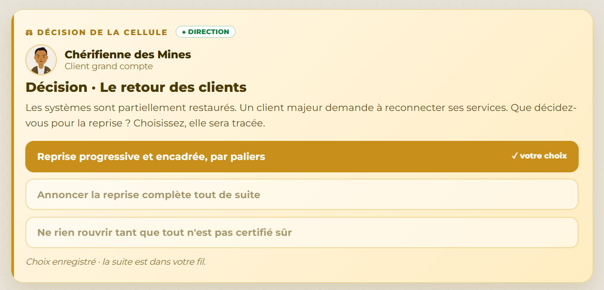

# Décision 12 — Reprise client progressive et encadrée

## Décision retenue

Reconnecter les services clients par paliers, après un point de contrôle technique et métier à chaque étape.

## Pourquoi ce choix

Les systèmes ne sont que partiellement restaurés. Une reprise graduelle permet de contrôler la sécurité, l'intégrité des données et la stabilité des services avant d'augmenter le périmètre. Chérifienne des Mines accepte ce calendrier parce qu'il donne de la visibilité sans annoncer une disponibilité non démontrée.

## Alternatives écartées

Annoncer une reprise complète immédiatement créerait une promesse risquée et pourrait diffuser une défaillance résiduelle. Ne rien rouvrir jusqu'à une certitude absolue prolongerait inutilement l'impact alors que certains paliers peuvent être validés.

## Défense devant le jury

Cette décision concilie disponibilité, intégrité et transparence : chaque réouverture est traçable et réversible. Elle s'inscrit dans une reprise contrôlée conforme à la logique du NIST CSF 2.0 et aux garde-fous décrits dans [REFERENCES_NORMES_ET_CADRE.md](REFERENCES_NORMES_ET_CADRE.md).
