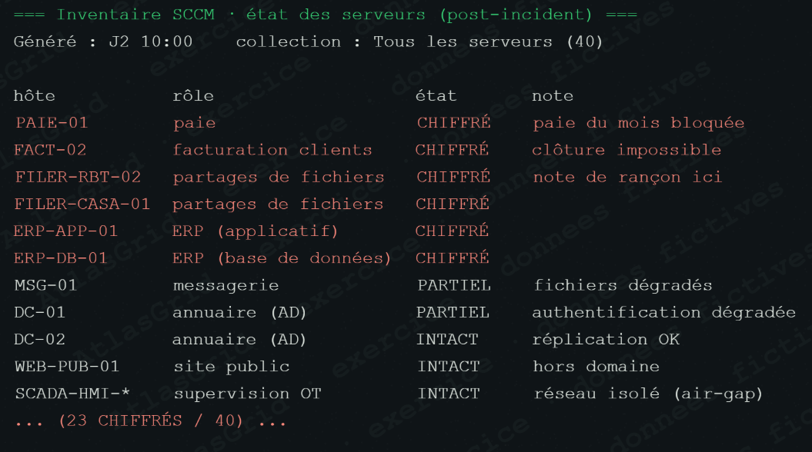
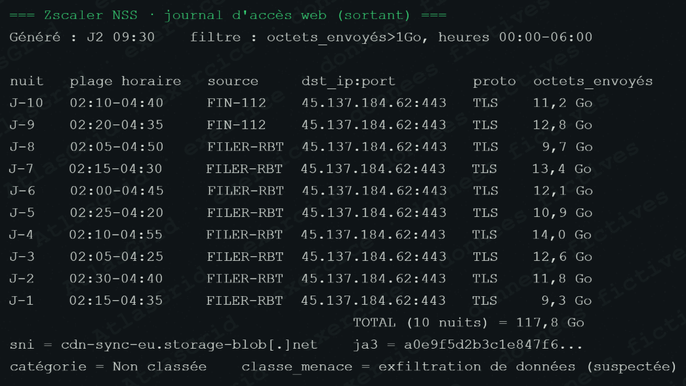
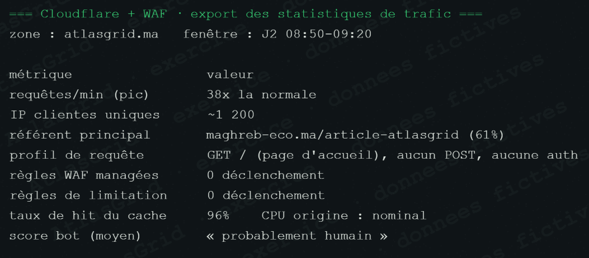
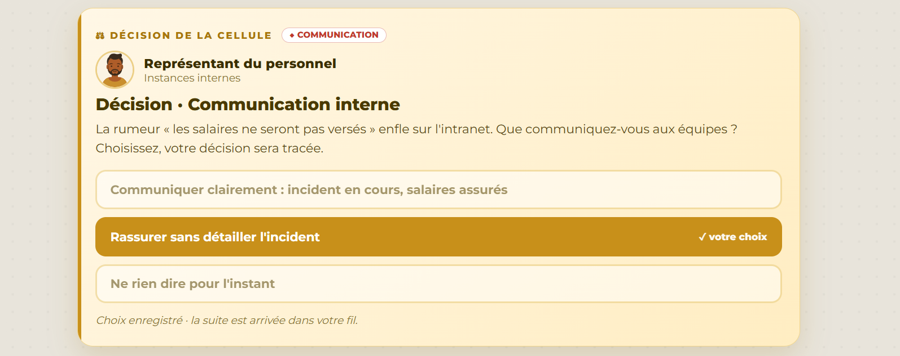
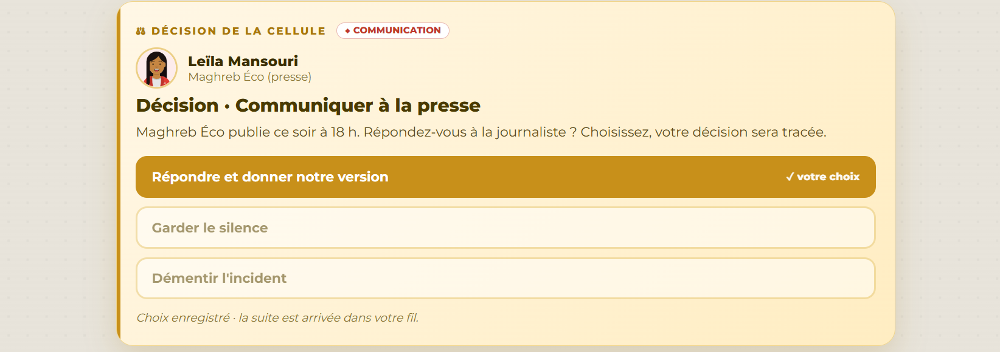
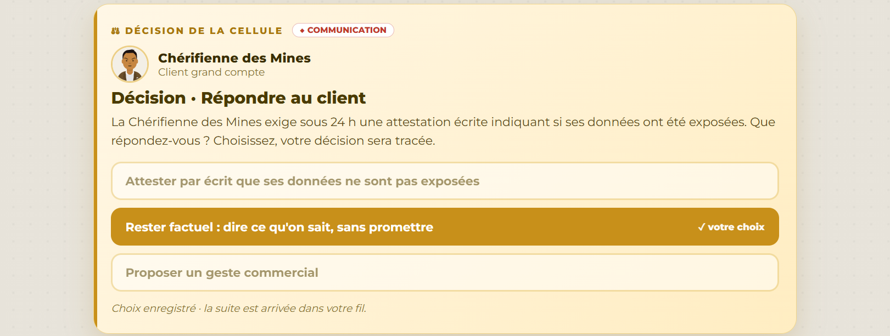

# Pôle Communication — fiche visuelle

## Rôle dans la crise

Le pôle Communication répond aux salariés, à la presse et aux clients. Il tient une ligne unique : dire les faits confirmés, expliquer les mesures en cours et ne pas transformer une hypothèse ou une revendication d'attaquant en information officielle.

## Position à défendre

AtlasGrid reconnaît l'incident, les mesures de confinement et l'investigation. Le pôle ne confirme ni les 300 Go revendiqués, ni un périmètre client précis, ni l'absence d'exposition d'un client avant qualification Forensic et Risque.

## Captures qui fondent les messages

### A-13 — Impact de service à expliquer avec prudence

### A-03 — Exfiltration objectivée, mais contenu encore à qualifier

### A-16 — Pic de trafic lié à l'article de presse, pas à un DDoS

### A-07 — Échantillon SIROCCO : exposition corroborée, volume non confirmé

## Décisions de communication

### Message interne rassurant, sans détail sensible

La cellule répond à la rumeur et donne des consignes, sans promettre ce que l'analyse ne permet pas encore d'assurer.

### Répondre à la presse avec une version factuelle

La réponse évite le silence, le déni et la divulgation d'informations sensibles.

### Répondre au client sans attestation non prouvée

Le client reçoit les éléments confirmés, les mesures prises et une échéance de mise à jour.

## Réponse orale proposée

> « Notre communication n'est ni le silence ni la promesse imprudente. Nous partageons ce qui est prouvé, protégeons les personnes concernées et nous engageons sur une méthode et des mises à jour vérifiables. »

Voir aussi [NOTE_POLE.md](NOTE_POLE.md) et [INFORMATIONS_DU_FIL_COMPLET.txt](INFORMATIONS_DU_FIL_COMPLET.txt).
