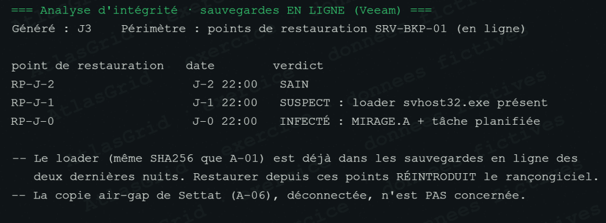

# Preuve A-30 — Intégrité des sauvegardes en ligne

## Fait établi

L'analyse Veeam réalisée à J3 indique que RP-J-2 est sain, RP-J-1 suspect et RP-J-0 infecté par MIRAGE. Le même chargeur `svhost32.exe` que celui observé dans A-01 est déjà présent dans les deux derniers points en ligne.

## Pourquoi c'est une preuve

La pièce relie les points de restauration en ligne à un indicateur déjà démontré dans l'incident : le chargeur présent sur FIN-112. Elle établit le risque concret de réintroduire le rançongiciel en restaurant depuis un point récent.

## Limites

RP-J-2 est signalé sain, mais la décision de reprise ne repose pas sur lui : la cellule privilégie une source physiquement isolée plutôt qu'une infrastructure ayant déjà subi le sabotage de rétention et l'indisponibilité des dépôts.

## Usage dans la décision

A-30 écarte la restauration rapide en ligne et renforce le choix de la copie air-gap de Settat décrit dans A-06.
