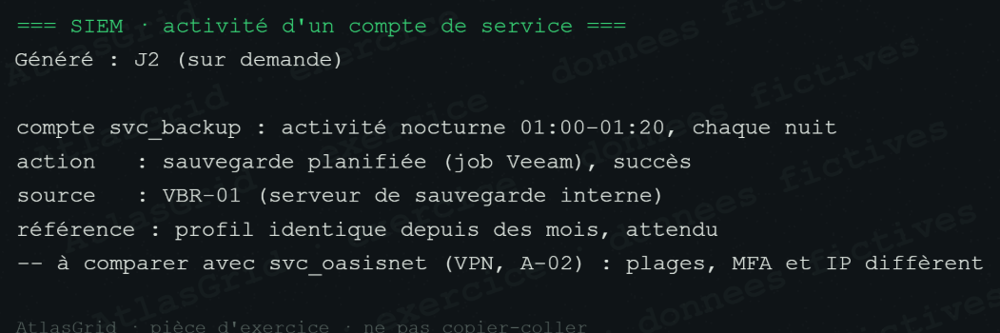

# Bruit A-28 — Activité attendue de `svc_backup`

Le compte `svc_backup` exécute chaque nuit une tâche Veeam planifiée depuis VBR-01, avec succès et selon un profil identique depuis des mois. Son comportement ne correspond pas aux accès VPN anormaux de `svc_oasisnet` : plages horaires, MFA et IP diffèrent.

**Verdict : Bruit, confiance sûre.** L'activité est réelle mais attendue ; elle ne doit pas être intégrée à la chaîne MIRAGE.
