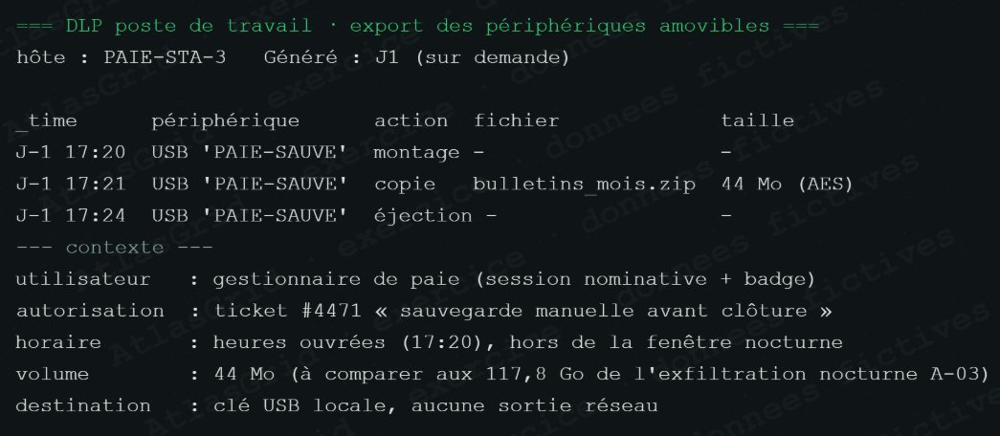

# Fausse piste A-17 — Copie locale de paie autorisée

## Pourquoi elle paraissait crédible

Une copie de données de paie sur support USB peut évoquer une exfiltration. Dans un incident impliquant un risque de fuite, ce signal doit être investigué avec attention.

## Vérifications et conclusion

La copie est couverte par le ticket **#4471**, réalisée en heures ouvrées, limitée à 44 Mo et sans sortie réseau observée. Son objectif de sauvegarde locale est documenté et l'opération respecte le circuit d'autorisation prévu.

## Pourquoi elle est écartée, sans être ignorée

Le volume, le moment, le ticket et l'absence de transfert externe contredisent le scénario d'exfiltration MIRAGE, qui concerne 117,8 Go de flux nocturnes. La pratique USB reste sensible et doit être contrôlée, mais elle n'est pas liée à l'attaque.

## Réponse courte au jury

> « Nous avons rapproché l'action de son autorisation, de son volume et de sa trace réseau. La comparaison avec l'exfiltration démontrée montre qu'il s'agit d'une opération légitime, pas d'un indice d'attaque. »

## Conformité et suites

Conserver le ticket, les journaux USB et la preuve d'absence de sortie réseau ; protéger les données de paie conformément à la loi 09-08 et appliquer le chiffrement du support si la procédure l'exige. Référence : [REFERENCES_METHODE_ET_CONFORMITE.md](REFERENCES_METHODE_ET_CONFORMITE.md).
