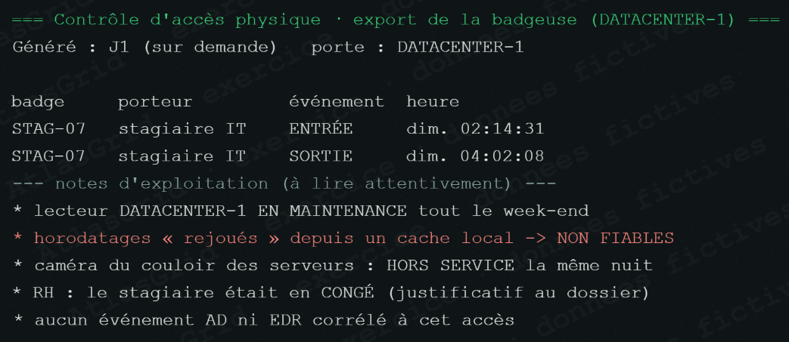

# Fausse piste A-14 — Passage badge au datacenter non fiable

## Pourquoi elle paraissait crédible

Un passage attribué à un stagiaire près du datacenter pouvait suggérer un accès physique non autorisé. Compte tenu des enjeux, la cellule devait vérifier cette hypothèse avant de l'écarter.

## Vérifications et conclusion

Le lecteur de badge était en maintenance et ses horodatages ne sont pas fiables ; la caméra associée est indisponible. Aucune corrélation n'apparaît dans les journaux AD, VPN ou EDR pendant la fenêtre d'attaque. La trace de badge isolée ne constitue donc pas une preuve d'accès physique lié à MIRAGE.

## Pourquoi elle est écartée, sans être ignorée

Les éléments de confirmation indépendants font défaut et la source principale est dégradée. Accuser ou suspecter une personne sur cette seule base serait disproportionné. La défaillance de contrôle physique reste, elle, un risque à corriger.

## Réponse courte au jury

> « Une badgeuse défaillante ne peut pas devenir une accusation. Nous avons cherché les corroborations techniques et opérationnelles ; elles n'existent pas. Nous écartons la piste tout en traitant la maintenance du contrôle d'accès. »

## Conformité et suites

Restreindre ce dossier aux personnes habilitées car il concerne un salarié identifiable ; consigner la maintenance, remettre la badgeuse à l'heure et prévoir un contrôle croisé fonctionnel. Référence : [REFERENCES_METHODE_ET_CONFORMITE.md](REFERENCES_METHODE_ET_CONFORMITE.md).
