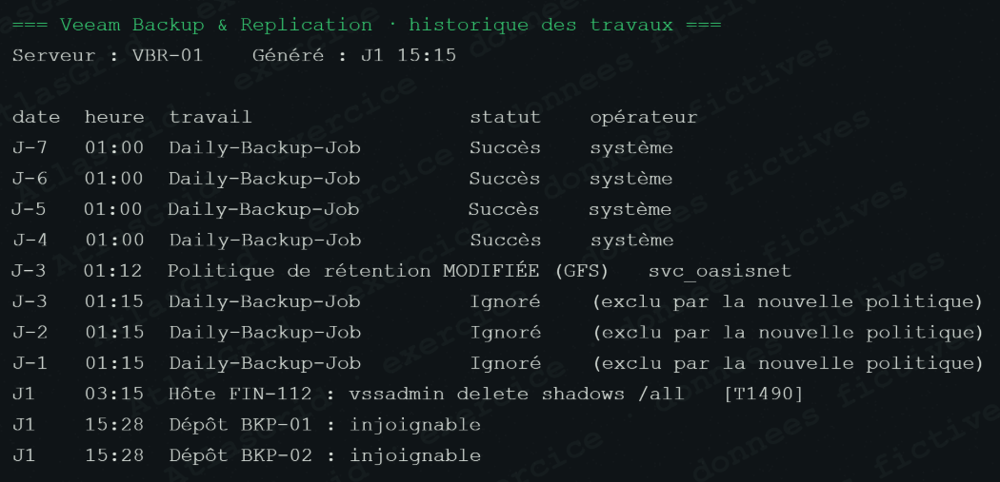
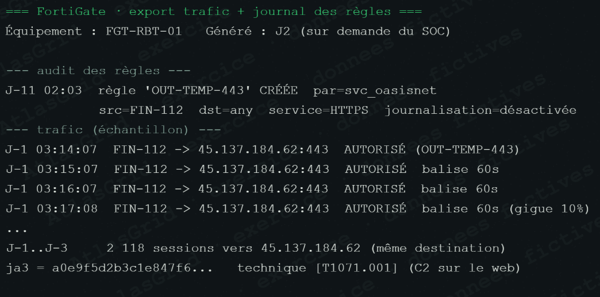
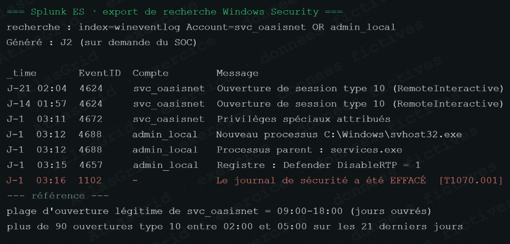
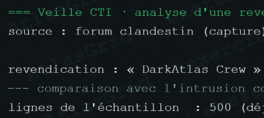
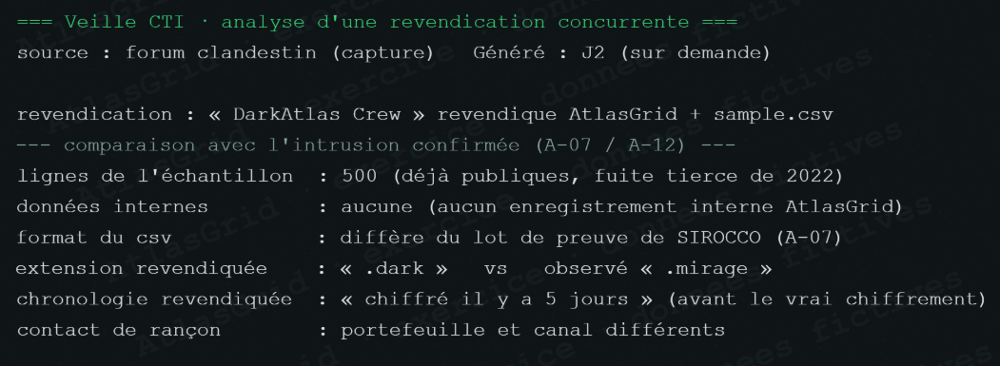

# Pôle Forensic — fiche visuelle

## Rôle dans la crise

Le pôle Forensic reconstitue le mode opératoire, préserve les traces et sépare les faits établis des hypothèses. Il ne transforme pas une revendication ou un signal isolé en attribution.

## Conclusion à porter

Les éléments convergent vers l'usage anormal de `svc_oasisnet`, une préparation réseau et sauvegarde, puis l'exécution de MIRAGE sur FIN-112. SIROCCO est crédible car son échantillon recoupe le risque d'exposition ; DarkAtlas est écarté faute de concordance technique.

## Captures et explications

### A-01 — Alerte EDR : binaire MIRAGE sur FIN-112

### A-02 — VPN : point d'entrée ou usage de compte à investiguer

### A-05 — Sauvegardes : préparation de l'attaque et entrave à la reprise

### A-09 — Pare-feu : ouverture du chemin de commande

### A-04 — NTFS : horodatages de note de rançon incohérents

### A-10 — SIEM : corrélation accès, privilèges et effacement de trace

### A-03 — Proxy : exfiltration suspectée de 117,8 Go, volume objectivé

### A-12 — Chronologie EDR : trois minutes de propagation et sabotage

### A-18 — Revendication DarkAtlas : extrait initial à contrôler

### A-18 — Revendication DarkAtlas invalidée

Les échantillons publics et les indicateurs différents empêchent de lier ce groupe à MIRAGE.

### A-07 — Publication SIROCCO : exposition corroborée, volume non confirmé

## Réponse orale proposée

> « Notre reconstitution ne repose pas sur un indicateur unique : elle croise VPN, SIEM, pare-feu, proxy, EDR, sauvegardes et artefacts NTFS. Nous prouvons une chaîne d'actions ; nous ne prétendons pas connaître l'identité physique de l'attaquant. »

Voir aussi [NOTE_POLE.md](NOTE_POLE.md) et [INFORMATIONS_DU_FIL_COMPLET.txt](INFORMATIONS_DU_FIL_COMPLET.txt).
