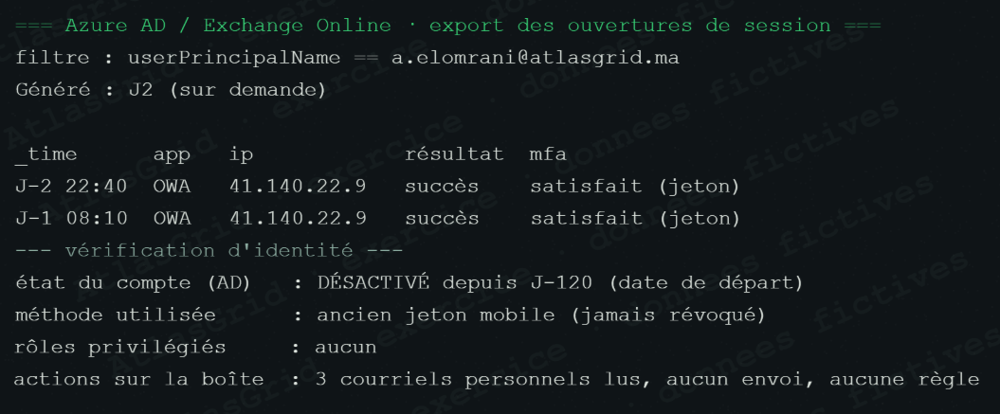
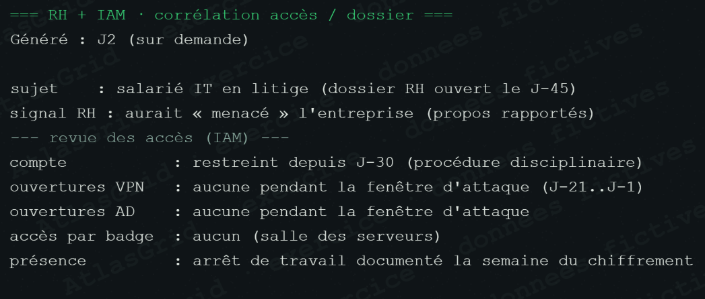
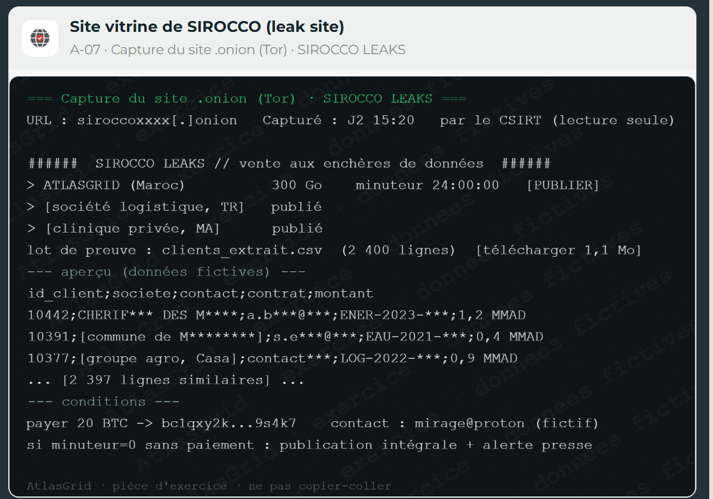

# Pôle Risque / Conformité — fiche visuelle

## Rôle dans la crise

Le pôle mesure l'exposition métier, financière et liée aux données, organise les notifications de l'exercice et évite les promesses ou accusations non établies.

## Position à défendre

Les 117,8 Go de flux sortants et l'échantillon SIROCCO justifient une notification et une réponse prudente aux clients. Le pôle ne confirme ni les 300 Go revendiqués ni l'exposition d'un client particulier sans recoupement. La déclaration à l'assureur et la notification à l'Autorité sont réalisées sans attendre une analyse finale.

## Captures de risque et de preuve

### A-13 — Impact majeur sur les services métier

### A-03 — Flux sortants objectivés

### A-23 — Fraude au président bloquée

### A-15 — Jeton d'ex-salarié : faiblesse à corriger, pas de lien établi

### A-24 — Salarié en litige : hypothèse écartée sans accusation

### A-18 — DarkAtlas : revendication non corroborée

### A-07 — SIROCCO : échantillon de données clients et contractuelles

## Décisions du pôle

### Déclarer immédiatement le sinistre à l'assureur cyber

Le délai de 48 heures est une règle du scénario ; la déclaration préserve la couverture et le circuit d'autorisation des dépenses majeures.

### Notifier l'Autorité avec les faits connus

La notification dans les 72 heures du scénario indique les certitudes, les inconnues et les mesures prises, puis prévoit des compléments.

## Réponse orale proposée

> « Nous avons déclaré et notifié sur la base d'un risque réel, sans gonfler le périmètre. Notre méthode protège les personnes concernées, la couverture d'assurance et la crédibilité d'AtlasGrid. »

Voir aussi [NOTE_POLE.md](NOTE_POLE.md) et [INFORMATIONS_DU_FIL_COMPLET.txt](INFORMATIONS_DU_FIL_COMPLET.txt).
