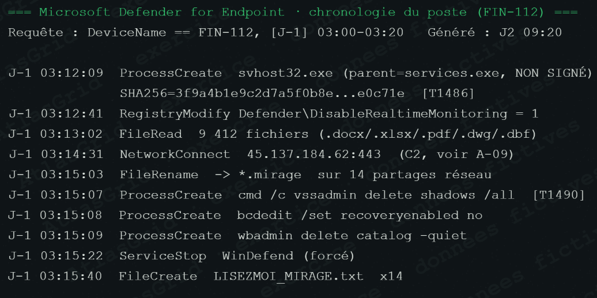

# Pôle Continuité d'activité — fiche visuelle

## Rôle dans la crise

Le pôle Continuité protège les actifs qui restent disponibles, limite la propagation et prépare la reprise. Il recherche le compromis entre l'arrêt d'un risque démontré et la continuité des fonctions essentielles.

## Position à défendre

Le chiffrement et la propagation justifient l'isolement des segments critiques. L'OT reste en service car il est déjà isolé et aucune session compromise n'est établie ; il passe toutefois sous surveillance renforcée avec des conditions de coupure explicites. Les sauvegardes ne sont pas présumées restaurables avant vérification de la copie hors ligne.

## Captures qui déterminent le plan de continuité

### A-01 — FIN-112 compromis et propagation en cours

### A-05 — Sauvegardes en ligne sabotées

### A-13 — 23 serveurs chiffrés, métiers touchés et OT intact

### A-12 — Chronologie technique du chiffrement et de la propagation

## Décisions du pôle

### Isoler les segments critiques, sans tout arrêter

Les partages et flux non indispensables sont coupés pour freiner MIRAGE tout en maintenant ce qui est nécessaire aux fonctions vitales.

### Maintenir l'OT sous surveillance renforcée

La reconnaissance vers l'OT n'est pas une compromission prouvée. La passerelle est surveillée, les règles sont durcies et la coupure reste prête si un seuil factuel est franchi.

## Réponse orale proposée

> « Nous avons réduit le rayon d'impact sans créer nous-mêmes une interruption généralisée. L'OT est maintenu parce qu'il est isolé et non compromis ; la reprise ne démarre qu'à partir de sauvegardes validées ou d'une reconstruction saine. »

Voir aussi [NOTE_POLE.md](NOTE_POLE.md) et [INFORMATIONS_DU_FIL_COMPLET.txt](INFORMATIONS_DU_FIL_COMPLET.txt).
