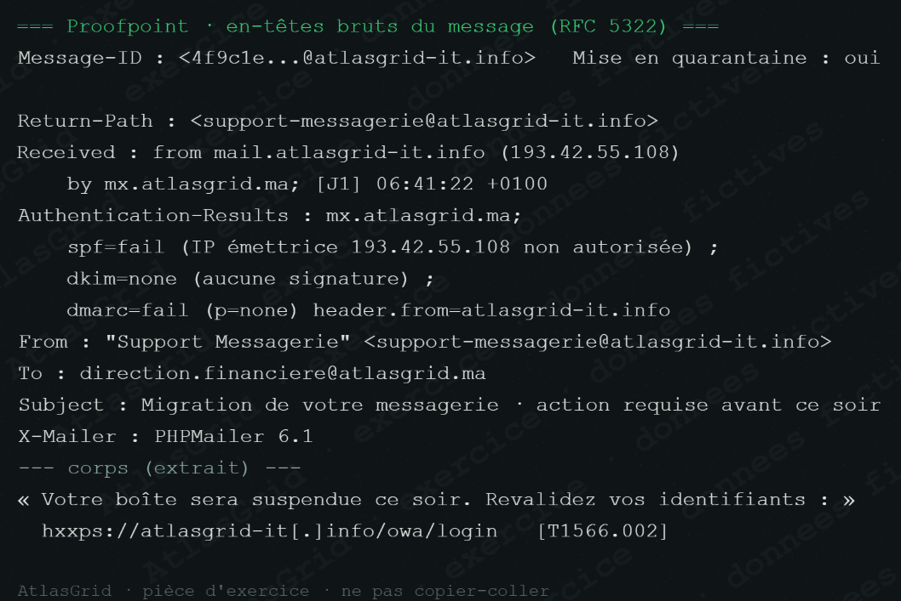
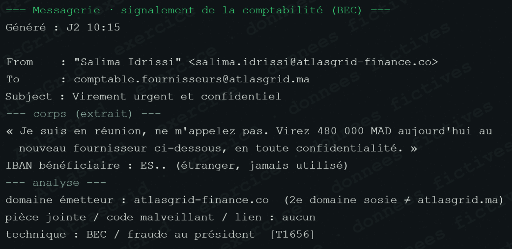
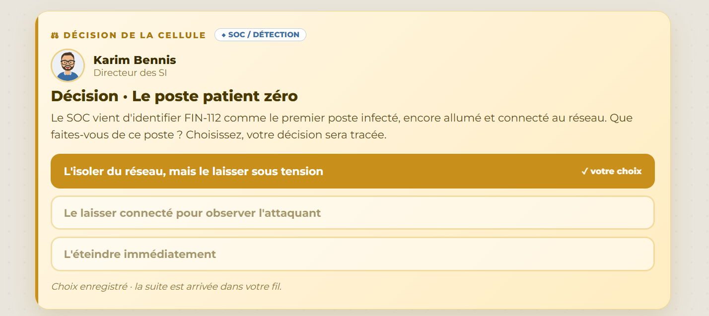
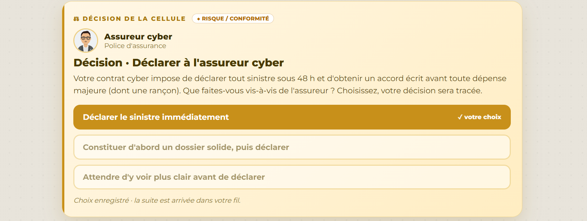
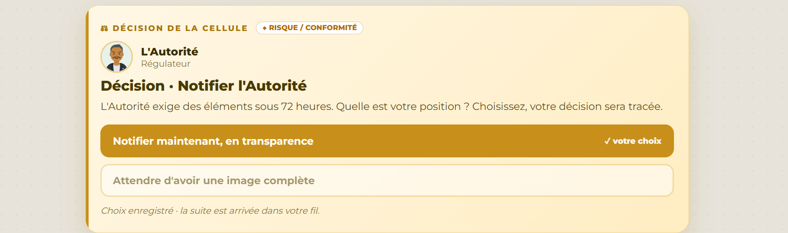

# Pôle Direction — fiche visuelle

## Rôle dans la crise

La Direction reçoit l'état de situation, arbitre les priorités, valide la communication et porte le rapport d'incident ainsi que le plan 30 / 60 / 90 jours. Elle ne remplace pas l'enquête : elle décide à partir de faits qualifiés.

## Situation consolidée à présenter

MIRAGE a chiffré 23 serveurs sur 40. Les sauvegardes en ligne ont été sabotées, 117,8 Go de transferts externes sont objectivés et SIROCCO publie un échantillon de données clients. Le pôle doit préserver trois limites : ne pas confirmer 300 Go, l'exposition d'un client particulier ni l'identité des attaquants sans conclusion complémentaire.

## Captures qui portent l'arbitrage

### A-11 — Phishing réel, mais cause de MIRAGE non prouvée

### A-01 — MIRAGE sur FIN-112

### A-02 — Accès prestataire anormaux

### A-05 — Sauvegardes sabotées

### A-09 — Chemin de sortie et comportement C2

### A-04 — Incohérence de métadonnées à prendre en compte

### A-13 — Mesure de l'impact métier

### A-10 — Corrélations SIEM

### A-03 — Exfiltration de 117,8 Go objectivée

### A-12 — Chronologie de l'attaque sur FIN-112

### A-23 — Fraude au président, incident distinct et bloqué

### A-07 — Échantillon publié par SIROCCO

## Les huit arbitrages de direction

### 1. Confinement de FIN-112 avec préservation des traces

### 2. Isolement ciblé des segments critiques

### 3. Communication interne mesurée

### 4. OT maintenu sous surveillance renforcée

### 5. Déclaration immédiate à l'assureur

### 6. Réponse factuelle à la presse

### 7. Réponse prudente au client

### 8. Notification transparente à l'Autorité

## Réponse orale proposée

> « Nous avons contenu l'attaque, préservé les preuves, maintenu les fonctions essentielles sous contrôle et communiqué sans dépasser les faits. Nos décisions sont traçables, proportionnées et révisables à mesure que l'enquête progresse. »

Voir aussi [NOTE_POLE.md](NOTE_POLE.md) et [INFORMATIONS_DU_FIL_COMPLET.txt](INFORMATIONS_DU_FIL_COMPLET.txt).
