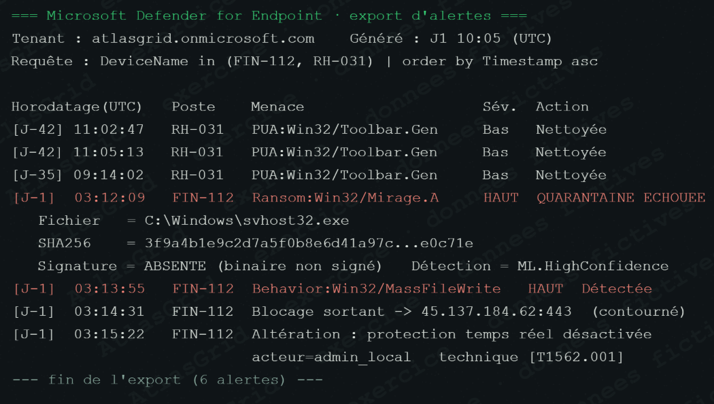

# Preuve A-01 — Alerte EDR MIRAGE sur FIN-112

## Fait objectivé

Le jour J-1 à 03:12:09, Defender détecte `Ransom:Win32/Mirage.A` sur **FIN-112**. Le binaire non signé `C:\\Windows\\svhost32.exe`, lancé via `services.exe`, est associé à une quarantaine échouée, à une écriture massive de fichiers et à l'altération de la protection en temps réel.

## Pourquoi cette pièce est une preuve

L'EDR fournit un hôte, une heure, un processus, un parent, un chemin de fichier, une détection et des événements comportementaux corrélés. Il établit la compromission de FIN-112 et l'activité de chiffrement sur cet hôte.

## Portée et limite

A-01 ne suffit pas à attribuer l'attaque à une personne ni à démontrer seul l'étendue sur tous les serveurs. Cette portée est consolidée par A-12, A-13 et les journaux réseau.

## Réponse courte au jury

> « A-01 n'est pas une simple alerte isolée : elle contient le binaire, son mode d'exécution et les comportements de chiffrement. Nous l'avons croisée avec la chronologie EDR et l'inventaire d'impact avant d'élargir notre conclusion. »

## Conservation et conformité

Exporter l'alerte et sa chronologie, conserver le binaire et les artefacts sur une copie forensique, calculer les empreintes et documenter toute analyse. FIN-112 doit rester isolé afin de préserver les traces volatiles. Référence : [REFERENCES_CONSERVATION_ET_CONFORMITE.md](REFERENCES_CONSERVATION_ET_CONFORMITE.md).
