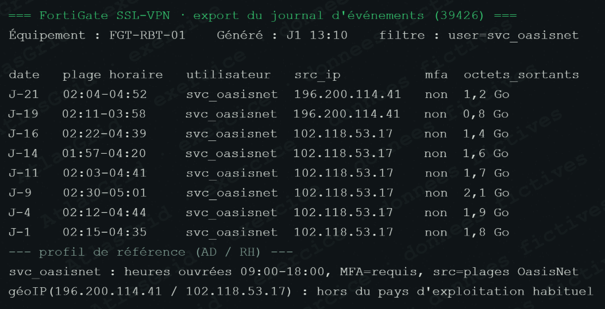

# Preuve A-02 — Accès VPN anormaux du compte `svc_oasisnet`

## Fait objectivé

De J-21 à J-1, le compte prestataire `svc_oasisnet` ouvre à répétition des sessions VPN nocturnes, entre environ 02:00 et 05:00, depuis des IP non conformes au profil OasisNet, sans MFA. Les volumes sortants et la répétition des sessions divergent des heures autorisées (09:00–18:00) et du contrôle MFA attendu.

## Pourquoi cette pièce est une preuve

Le journal FortiGate enregistre le compte, l'adresse IP, l'heure, le résultat MFA et les volumes. Il montre objectivement une utilisation du compte incompatible avec le profil autorisé et fonde l'hypothèse de compromission ou d'abus du compte.

## Portée et limite

La preuve établit l'anomalie d'accès ; elle ne permet pas à elle seule d'identifier la personne derrière le compte ni de démontrer chacune des actions réalisées après connexion. A-10, A-09 et A-05 apportent les corrélations nécessaires.

## Réponse courte au jury

> « Nous ne disons pas que le prestataire est responsable. Nous disons que son compte a été utilisé d'une manière objectivement incompatible avec les règles d'accès, ce qui justifie la révocation, l'investigation et le contrôle du fournisseur. »

## Conservation et conformité

Exporter les journaux VPN bruts avec le fuseau horaire, la configuration MFA et la liste des IP autorisées ; préserver les journaux du prestataire et limiter leur accès. L'analyse est fondée sur confidentialité, intégrité et disponibilité, sans conclure à une attribution personnelle sans éléments complémentaires. Référence : [REFERENCES_CONSERVATION_ET_CONFORMITE.md](REFERENCES_CONSERVATION_ET_CONFORMITE.md).
