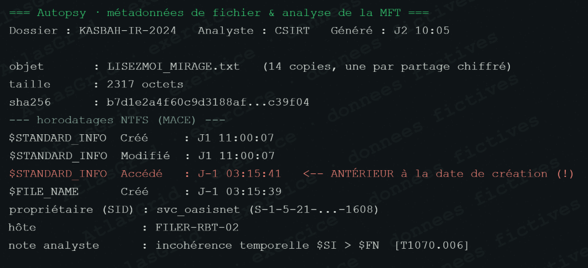

# Preuve A-04 — Métadonnées NTFS incohérentes sur la note MIRAGE

## Fait objectivé

Sur FILER-RBT-02, les quatorze copies de `LISEZMOI_MIRAGE.txt` présentent une création `$FILE_NAME` à J-1 03:15:39 et un accès `$STANDARD_INFORMATION` à J-1 03:15:41. Pourtant, les métadonnées affichées indiquent création et modification à J1 11:00:07. Le propriétaire indiqué est `svc_oasisnet`.

## Pourquoi cette pièce est une preuve

La comparaison des deux attributs NTFS fournit des traces internes indépendantes du simple affichage de l'explorateur. Leur divergence temporelle est observable et reproductible sur l'image ou le volume préservé : elle atteste une incohérence de métadonnées.

## Portée et limite

La pièce démontre une incohérence compatible avec une altération de traces ; elle ne permet pas, seule, d'identifier l'outil ou la personne qui l'a provoquée. Elle ne doit donc pas être présentée comme une attribution.

## Réponse courte au jury

> « Nous n'affirmons pas qui a modifié l'horodatage. Nous montrons que deux sources NTFS incompatibles rendent la date affichée non fiable, puis nous retenons la chronologie corroborée par l'EDR et les journaux. »

## Conservation et conformité

Préserver une image en lecture seule du volume, noter les attributs extraits, l'outil et sa version, puis calculer les empreintes des exports. Ne pas modifier les fichiers originaux. Référence : [REFERENCES_CONSERVATION_ET_CONFORMITE.md](REFERENCES_CONSERVATION_ET_CONFORMITE.md).
