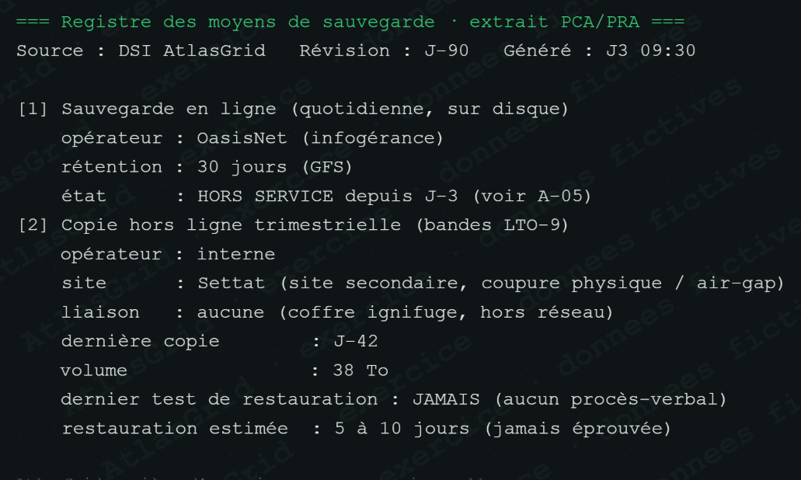

# Preuve A-06 — Registre des moyens de sauvegarde

## Fait établi

À J3 09:30, le registre de la DSI confirme que la sauvegarde en ligne opérée par OasisNet est hors service depuis J-3. Il identifie aussi une copie trimestrielle LTO-9, conservée à Settat dans un coffre ignifugé et sans liaison réseau. Sa dernière copie date de J-42 ; elle n'a jamais fait l'objet d'un test de restauration formalisé.

## Pourquoi c'est une preuve

Le registre fournit la source, le support, le site, l'isolement et la date de la copie. Ces éléments objectivent l'existence d'une source de reprise indépendante de l'infrastructure en ligne compromise.

## Limites

La pièce ne prouve pas que la restauration réussira : elle reste ancienne et non testée. Elle justifie donc une reprise contrôlée, avec tests et validation avant remise en production.

## Usage dans la décision

Cette preuve fonde le choix de l'air-gap de Settat et l'estimation de 5 à 10 jours de reprise. Elle doit être lue avec A-30, qui écarte les points en ligne les plus récents.
