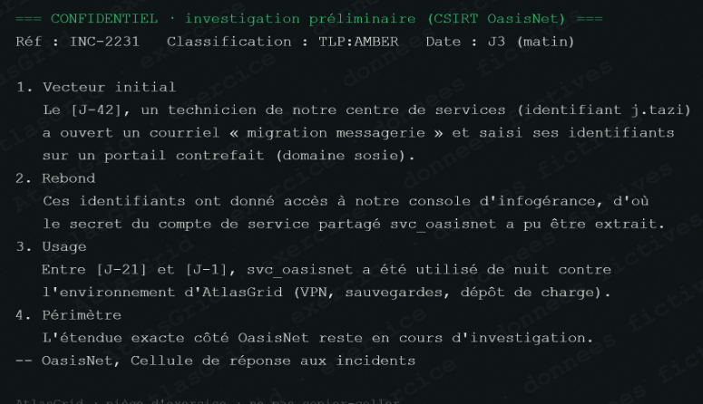

# Preuve A-08 — Rapport préliminaire d'OasisNet

## Ce que le rapport établit

OasisNet rapporte qu'à J-42, un technicien a saisi ses identifiants sur un portail de migration contrefait. Ces identifiants ont donné accès à la console d'infogérance, depuis laquelle le secret du compte partagé `svc_oasisnet` a pu être extrait. Le compte a ensuite été utilisé de nuit contre AtlasGrid entre J-21 et J-1.

## Pourquoi c'est une preuve

Le rapport externe recoupe les traces internes A-02, A-05 et A-10 : même compte de service et même fenêtre d'usage. Il apporte une explication cohérente du vecteur initial sans remplacer les journaux conservés par AtlasGrid.

## Ce qu'il ne permet pas d'affirmer

Il est préliminaire : l'étendue exacte de la compromission chez OasisNet, l'identité réelle de l'attaquant et les responsabilités ne sont pas encore établies. **Confiance : à confirmer.**
